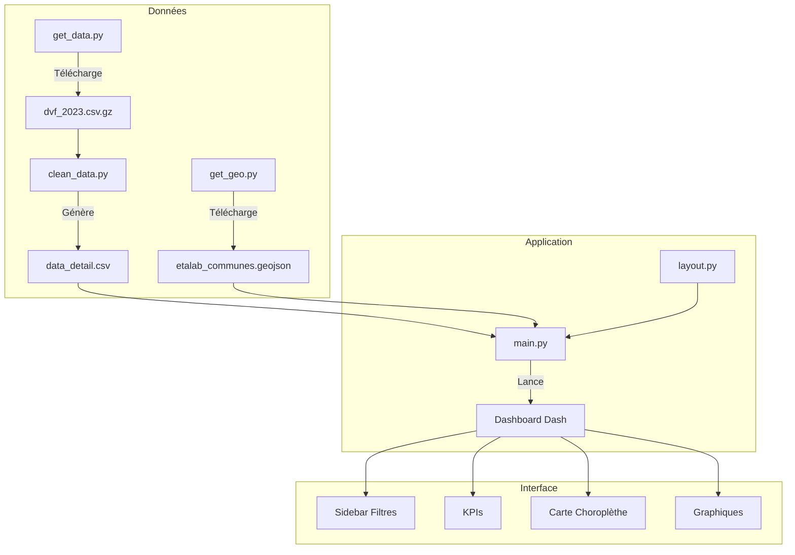

# ImmoViz France 🏠

Dashboard interactif de visualisation des données immobilières françaises basé sur les Demandes de Valeurs Foncières (DVF) 2023.

---

## 📖 User Guide

### Prérequis
- Python 3.9 ou supérieur
- pip (gestionnaire de paquets Python)

### Installation

1. **Cloner le dépôt**
```bash
git clone <url-du-depot>
cd Projet-data
```

2. **Installer les dépendances**
```bash
pip install -r requirements.txt
```

3. **Télécharger les données** (première utilisation uniquement)
```bash
python src/utils/get_data.py    # Télécharge DVF 2023 (~100 Mo)
python src/utils/get_geo.py     # Télécharge GeoJSON France (~30 Mo)
python src/utils/clean_data.py  # Nettoie et prépare les données
```

4. **Lancer le dashboard**
```bash
python main.py
```

5. **Accéder au dashboard**  
   Ouvrir un navigateur à l'adresse : `http://127.0.0.1:8050`

### Utilisation du Dashboard

| Filtre | Description |
|--------|-------------|
| **Département** | Sélectionner un département ou "France Entière" |
| **Type de bien** | Maison et/ou Appartement |
| **Période** | Date début et fin (année 2023) |
| **Prix/m²** | Fourchette de prix au m² |
| **Nb Ventes Min** | Nombre minimum de ventes par commune |

> **Note** : Cliquez sur "Actualiser" après avoir modifié les filtres.

---

## 📊 Data

### Sources de données

| Donnée | Source | Format | Taille |
|--------|--------|--------|--------|
| Transactions immobilières | [DVF - data.gouv.fr](https://files.data.gouv.fr/geo-dvf/latest/csv/2023/full.csv.gz) | CSV.GZ | ~100 Mo |
| Contours communes | [Etalab Contours Administratifs](https://etalab-datasets.geo.data.gouv.fr/contours-administratifs/2024/geojson/communes-100m.geojson) | GeoJSON | ~30 Mo |

### Structure des données

```
data/
├── raw/
│   ├── dvf_2023.csv.gz           # Données DVF brutes
│   └── etalab_communes.geojson   # Contours géographiques
└── cleaned/
    └── data_detail.csv           # Données nettoyées pour le dashboard
```

### Variables principales

| Variable | Description |
|----------|-------------|
| `code_commune` | Code INSEE de la commune |
| `nom_commune` | Nom de la commune |
| `valeur_fonciere` | Prix de vente (€) |
| `surface_reelle_bati` | Surface habitable (m²) |
| `prix_m2` | Prix au m² calculé |
| `type_local` | Maison ou Appartement |
| `date_mutation` | Date de la transaction |

---

## 🛠️ Developer Guide

### Architecture du projet



### Structure des fichiers

```
Projet-data/
├── main.py                 # Point d'entrée, callbacks Dash
├── requirements.txt        # Dépendances Python
├── README.md
├── data/                   # Données (raw & cleaned)
├── assets/                 # CSS personnalisé
└── src/
    ├── components/
    │   └── layout.py       # Interface utilisateur (sidebar + content)
    └── utils/
        ├── get_data.py     # Téléchargement DVF
        ├── get_geo.py      # Téléchargement GeoJSON
        └── clean_data.py   # Nettoyage des données
```

### Ajouter un nouveau graphique

1. **Dans `layout.py`** : Ajouter un composant `dcc.Graph` dans la zone `content`
```python
dbc.Col(dbc.Card([
    dbc.CardHeader("Mon Nouveau Graphique"),
    dbc.CardBody(dcc.Graph(id='mon-graph', style={'height': '300px'}))
]), width=12, md=6),
```

2. **Dans `main.py`** : Ajouter l'output dans le callback `update_dashboard`
```python
@app.callback(
    [..., Output('mon-graph', 'figure')],  # Ajouter ici
    [Input('btn-update', 'n_clicks')],
    [...]
)
def update_dashboard(...):
    # Créer le graphique avec Plotly
    fig_mon_graph = px.bar(df, x='...', y='...')
    return ..., fig_mon_graph
```

### Ajouter un nouveau filtre

1. Ajouter le composant dans `layout.py` (sidebar)
2. Ajouter le `State` correspondant dans le callback de `main.py`
3. Utiliser la valeur pour filtrer le DataFrame

---

## 📈 Rapport d'analyse

### Principales conclusions

1. **Disparité géographique majeure**
   - Paris et sa proche banlieue affichent les prix au m² les plus élevés (>10 000 €/m²)
   - Les zones rurales présentent des prix nettement inférieurs (<2 000 €/m²)

2. **Répartition des types de biens**
   - Les appartements dominent dans les grandes métropoles
   - Les maisons sont majoritaires en zone rurale et périurbaine

3. **Évolution temporelle**
   - Stabilité relative des prix sur l'année 2023
   - Pic de transactions observé au printemps (avril-juin)

4. **Top 10 des communes les plus chères**
   - Dominé par les arrondissements parisiens (6e, 7e, 8e, 16e)
   - Présence de communes du littoral (Côte d'Azur, Bassin d'Arcachon)

5. **Distribution des prix**
   - Distribution asymétrique avec une longue queue vers les valeurs élevées
   - Médiane nationale autour de 3 000 €/m² pour les appartements

---

## ⚖️ Copyright

### Déclaration d'originalité

Je déclare sur l'honneur que le code fourni a été produit par moi-même, à l'exception des éléments ci-dessous :

### Code externe utilisé

| Lignes / Fichier | Source | Description |
|------------------|--------|-------------|
| `main.py` - Configuration Dash | [Documentation Dash](https://dash.plotly.com/) | Structure de base d'une application Dash |
| `main.py` - `px.choropleth_mapbox` | [Plotly Express Docs](https://plotly.com/python/mapbox-choropleth-maps/) | Création de cartes choroplèthes |
| `layout.py` - Composants Bootstrap | [Dash Bootstrap Components](https://dash-bootstrap-components.opensource.faculty.ai/) | Utilisation des composants dbc.Card, dbc.Row, dbc.Col |
| `clean_data.py` - Lecture par chunks | [Pandas Documentation](https://pandas.pydata.org/docs/reference/api/pandas.read_csv.html) | Paramètre `chunksize` pour traitement par morceaux |

### Données

- **DVF (Demandes de Valeurs Foncières)** : Données ouvertes sous [Licence Ouverte 2.0](https://www.etalab.gouv.fr/licence-ouverte-open-licence)
- **Contours administratifs** : [Etalab](https://github.com/etalab/decoupage-administratif) - Licence Ouverte 2.0

---

> **Toute ligne non déclarée ci-dessus est réputée être produite par l'auteur du projet.**  
> L'absence ou l'omission de déclaration sera considérée comme du plagiat.

---

*Projet réalisé dans le cadre du cours E3-FI - ESIEE Paris*